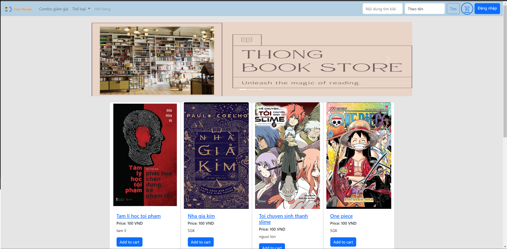
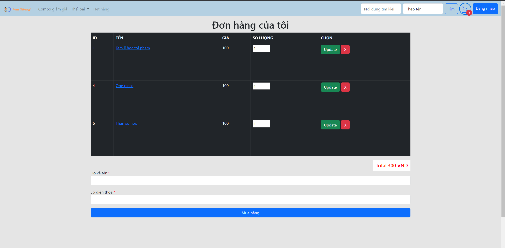
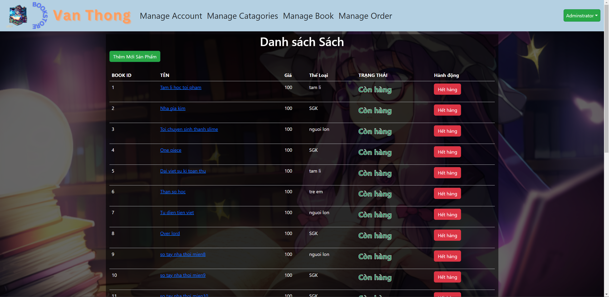

# Book Store Project

This project is a web application that allows users to browse and purchase books online. It also includes an admin page for managing the book inventory. The project is built using JSP/Servlet, SQL Server for the database, and JDBC for connecting to the database.

## Features

- User Registration and Login: Users can create an account and login to the system to access the features.
- Book Catalog: Users can browse through the available books, view book details, and add books to their shopping cart.
- Shopping Cart: Users can add books to their shopping cart, view the cart contents, and proceed to checkout.
- Admin Dashboard: Admin users have access to an admin page where they can manage the book inventory, including adding new books, updating book information, and deleting books.
- Image Upload: The project includes a feature to upload book images, allowing users to see visual representations of the books.processes.

## Technologies Used

- JSP (JavaServer Pages)
- Servlets
- SQL Server
- JDBC (Java Database Connectivity)
- HTML/CSS
- Bootstrap
- JavaScript

## Getting Started

- Clone the project repository: git clone `https://github.com/kidhood/bookstore-web`
- Import the project into your preferred IDE.
- Configure the database connection properties in the db.properties file.
- Run the SQL scripts to create the necessary database tables and insert initial data.
- Start the application server and deploy the project.
- Access the application in your web browser at `http://localhost:8080/BigAssignment_2`

## Demo

Here are some demo images of the Book Store application:

The home page displays featured books and allows users to browse through different categories.

Users can view the details of a specific book, including its description, price, and availability.

Admin users have access to an admin dashboard to manage the book inventory.

## Contributing

Contributions to the Book Store project are welcome. If you find any issues or have suggestions for improvements, please feel free to submit a pull request or open an issue.
